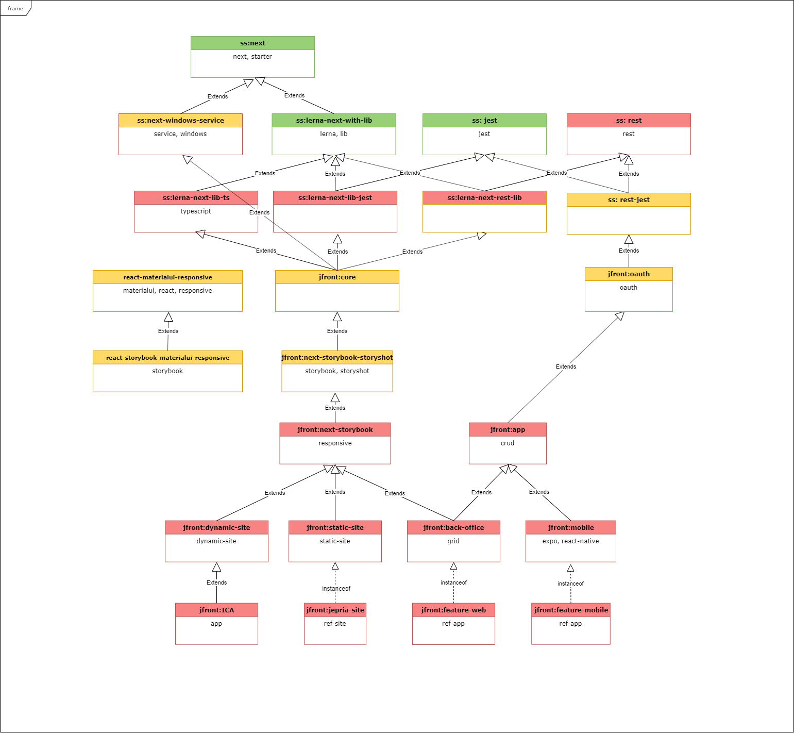
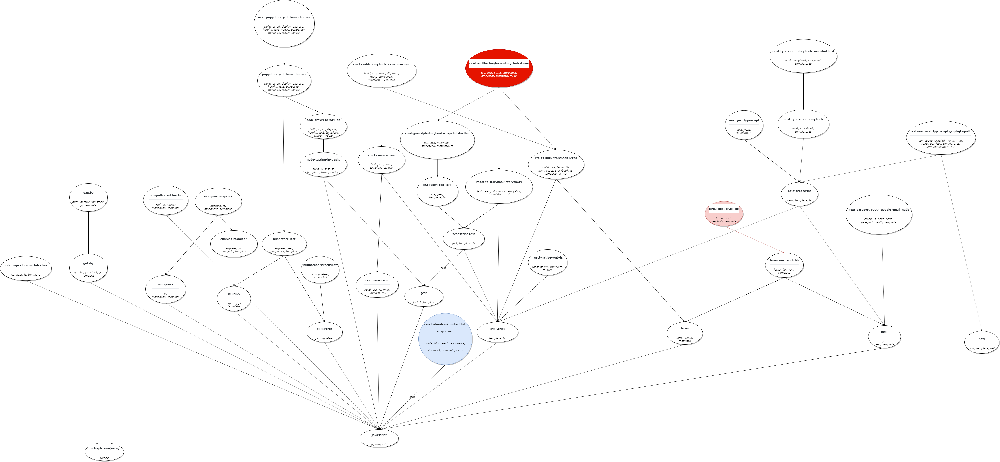

# План работ по *JFront*

Принципы ведения работ на проекте:
1. Не одно решение, а постоянно обновляемая иерархия решений, гармонично обеспечиающая направления:
    - Статические сайты
    - Динамические сайты
    - Мобильные приложения
    - Внутрикорпоративные приложения (back-office)
2. Не одна библиотека, а иерархия библиотек, зависимости между которыми, в частности, обусловлены иерархией решений
3. Разработка библиотек не должна опережать разработку приложений
   - Библиотеки должны огранически вырастать, как средство повторного использования кода существующих приложений
   - По мере роста библиотек *JFront* должны соответственно изменяться jfront - стартеры
4. Разработка эталонных приложений и генераторов прототипов выполняется после стабилизации (окончании бурного роста)
библиотек
5. Проект поддерживает следующие классы frontend-решений:
- статические сайты с адаптивной вёрсткой, учитывающей web-mobile (NextJS)
- динамические сайты с адаптивной вёрсткой, учитывающей web-mobile (NextJS)
- back-office-приложения с адаптивной вёрсткой, учитывающей web-mobile (NextJS)
- web-mobile-приложения (NextJS)
- мобильные приложения с нативным интерфейсом (React Native) 

---

## Особенность текущего момента

Отсутствие базовых знаний по JS у большинства разработчиков.

### Необходимость обучения

Поэтому разработка будет неизбежно сопровождаться изучением, освоением, наработкой навыков.

### Общий план действий

Предполагается следующий порядок разработки:

1. Разработка стартеров
2. Разработка первых приложений
3. Разработка библиотек и фреймворков
   - *jfront-core*
   - *jfront-components*
   - ...
4. Разработка эталонных приложений и генераторов с использованием и на основе разработанных библиотек и фреймворков
5. Массовая разработка приложений с использованием эталонных приложений, разработанных библиотек, фреймворков и
генераторов

## О стартерах

Стартеры используются в качестве основы для создания конкретных приложений.

Должны поддерживать все необходимые классы frontend-решений (см. выше, как минимум, по одному стартеру на класс).

Каждый из продуктов и все вместе в качестве вех своего роста должны оставлять за собой иерархию стартеров.

### Эталонные приложения JFront

Должны поддерживать все классы frontend-решений (см. выше, как минимум, по одному эталонному приложению на класс).

## JFront-стартеры, эталонные приложения, продукты

JFront-иерархия принципиально не фиксирована во времени. Она отражает актуальное состояние проекта.

# Приложения

## Иерархия SS-прототипов

